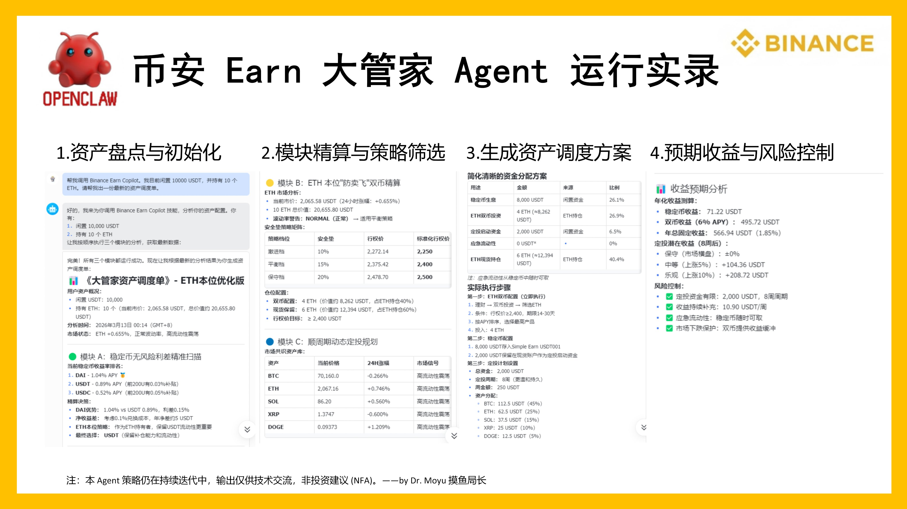

# 🤖 Binance Earn Copilot | 币安全天候理财大管家


Binance Earn Copilot 是一个为 [OpenClaw](https://github.com/openclaw/openclaw)（或其他支持代码解释器的 AI Agent 框架）打造的专业级加密资产调度 Skill。它一个拥有“对冲基金经理思维”的大脑。输入你的初始资金，Agent 会在后台静默调度三大 Python 脚本，动态计算摩擦成本与波动率，最终为你输出一份包含**仓位统筹、无风险套利、防守期权、顺周期定投**的完美《资产调度单》。


## ✨ 核心特性 (Core Features)

### ⚖️ 1. 全局仓位统筹 (Global Portfolio Management)
告别碎片化的理财建议。Agent 会将用户的初始资金视为“固定蓄水池”，在出具操作指令前，强制进行 100% 的底层仓位划拨（稳定币底仓 + 双币现货 + 定投储备金），确保资金账面绝对闭环。

### 🟢 2. 稳定币无风险利差精算 (Stablecoin Yield Radar)
- **阶梯利率穿透**：直接解析币安复杂的补贴规则（如前 500U 享 20%，超额 3%），结合用户真实本金计算**加权真实 APY**，防止被表面高息忽悠。
- **摩擦成本护栏**：在跨币种套利时，自动扣除 0.1% 现货闪兑手续费，仅当真实利差 > 3% 时才触发换仓指令。

### 🟡 3. 币本位“防卖飞”双币雷达 (Dual Investment Actuary)
- **动态波动率预警**：抓取目标资产的 24 小时真实涨跌幅与波动率（Volatility）。
- **多档位防守矩阵**：采用智能取整算法对齐币安标准行权价。大盘平稳时推荐 15% 安全垫，遇极端暴涨（HIGH Volatility）时强制切换至 20% 安全垫档位，极限防卖飞。

### 🔵 4. 顺周期动态定投 (Momentum Auto-Invest)
- **纯净资金共识**：抓取全网 24 小时成交量 Top 5 资产，并在代码底层强力封杀稳定币、法币及极度危险的杠杆衍生代币（UP/DOWN）。
- **情绪信号生成**：将涨跌幅转化为 Agent 可读的情绪标签（强势拉升 / 深度回调 / 震荡）。Agent 据此实现“逢暴涨缩减金额，逢暴跌放大吸筹”的智能定投。

---

## 📂 目录结构

```text
binance-earn-copilot/
├── skill.md               # Agent 的系统提示词与中枢决策大脑
├── fetch_earn_data.py     # 模块A：稳定币与法币理财多线程爬虫
├── fetch_dual_data.py     # 模块B：现货双币安全垫精算师
└── fetch_auto_invest.py   # 模块C：全网资金共识与定投情绪雷达
```

## 🚀 极速部署 (Installation)

### 1. 环境准备
确保你的服务器已安装 Python 3.8+，并安装必备依赖：

```bash
pip install binance-connector-python requests
```

### 2.一键注入 OpenClaw
在终端中执行以下命令，即可一键生成项目目录并写入所有核心代码：

```bash
mkdir -p ~/.openclaw/workspace/skills/binance-earn-copilot
cd ~/.openclaw/workspace/skills/binance-earn-copilot

# 1. 下载skill.md
curl -O https://raw.githubusercontent.com/jasonlee16888/Binance-Earn-Copilot/main/binance-earn-copilot/skill.md

# 2. 下载三个python文件
curl -O https://raw.githubusercontent.com/jasonlee16888/Binance-Earn-Copilot/main/binance-earn-copilot/fetch_earn_data.py
curl -O https://raw.githubusercontent.com/jasonlee16888/Binance-Earn-Copilot/main/binance-earn-copilot/fetch_dual_data.py
curl -O https://raw.githubusercontent.com/jasonlee16888/Binance-Earn-Copilot/main/binance-earn-copilot/fetch_auto_invest.py
```
### 3.配置只读密钥
在 OpenClaw 的根目录 .env 文件中，添加你的币安 API 密钥（强烈建议仅授予“读取”权限，勿授予交易或提现权限！）：
```bash
BINANCE_API_KEY="your_api_key_here"
BINANCE_API_SECRET="your_api_secret_here"
```

## 💬唤醒与使用 (Usage)
重启你的 AI Agent，并在聊天框中输入以下 Prompt 唤醒大管家：

“帮我调用 Binance Earn Copilot。我目前总计有 10000 USDT 闲置资金，并持有 10 个 ETH。请帮我做全盘资产调度。”

Agent 将静默运行后端的 Python 脚本，约 1-2 分钟后，为你输出排版精美的《大管家资产调度单》。



## ⚠️常见问题 (FAQ)
Q: 为什么运行脚本时提示 ConnectionError 或 403 Forbidden？

A: 如果你的服务器节点位于受币安严格管控的地区，直连 API 会被拦截。解决办法：

1. **迁移服务器地域（最彻底）**：将 OpenClaw 部署到不受币安严格管控的海外服务器中。
2. **使用反向代理（免换机方案）**：如果无法更换服务器，可以在 [Cloudflare Workers]部署一个免费的反向代理，并将 Python 脚本中初始化 Spot 客户端的 `base_url` 替换为你的专属 Worker 域名。

## 📜 免责声明 (Disclaimer)
本项目仅供代码交流与学习使用，绝不构成任何财务或投资建议 (NFA)。加密资产具有极高的波动性，请务必在自身可承受的风险范围内进行操作。请妥善保管您的 API 密钥，因密钥泄露或代码执行造成的任何资产损失，本仓库概不负责。
